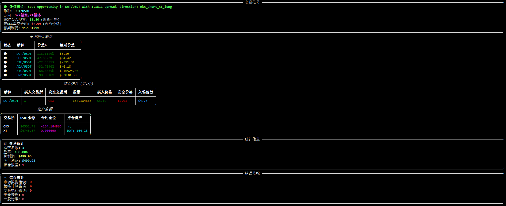

# 跨交易所多币种套利系统 (Multi-Asset ArbitrageBot)

这是一个MVP版本的多币种套利机器人，可以监控OKX和XT交易所的多个交易对价格差异，并进行模拟交易。

## 运行截图


## 套利原理
### 核心概念：什么是“跨交易所合约套利”？
这其实是一种套利策略。基本思路是：

发现价差：当您发现交易所A的永续合约或期货合约价格（比如比特币BTC）明显高于交易所B的现货价格时，机会就出现了。

同时开立两个方向相反的头寸：

在价格高的交易所A：开空（Sell Short） 合约。因为你预期价格会下跌，会向交易所B的现货价格靠拢。

在价格低的交易所B：用现金买入（Buy） 等量的现货比特币。

等待价格收敛：当两个市场的价格差缩小甚至消失时（这通常是必然发生的，因为套利者本身的行为就会推动价格趋于一致），同时平掉两个头寸。

赚取利润：利润就来自于最初开仓时的价差减去交易手续费和资金费用。

举例说明：

### 假设交易所A的BTC永续合约价格为 $61,000

交易所B的BTC现货价格为 $60,000

价差为 $1,000

您的操作：

在交易所A 开空 1个BTC的合约（价值$61,000）。

同时在交易所B 买入 1个BTC的现货（花费$60,000）。

#### 情景一：价格收敛到$60,500

交易所A（合约空单）：价格从$61,000跌到$60,500，你盈利 $500。

交易所B（现货）：价格从$60,000涨到$60,500，你盈利 $500。

总盈利：$500 + $500 = $1000 (再减去两边的手续费和交易所A的空头资金费用)。

#### 情景二：现货价格上涨，带动合约价格上涨（但价差缩小）

交易所B现货涨到$61,500。

交易所A合约也涨到$61,800（价差从$1000缩小为$300）。

交易所A（合约空单）：价格从$61,000涨到$61,800，你亏损 $800。

交易所B（现货）：价格从$60,000涨到$61,500，你盈利 $1,500。

总盈利：$1,500 - $800 = $700 (再减去费用)。

**无论价格整体是涨是跌，只要价差缩小了，你就能盈利。**

## 支持的交易对

系统动态获取OKX和XT交易所支持的交易对，并自动选择两个交易所都支持的交易对进行套利。

默认支持以下交易对,同时会动态获取两个交易所都支持的币种。
- BTC/USDT
- ETH/USDT
- BNB/USDT
- ADA/USDT
- DOT/USDT

### 动态新币种检测
系统会定期检查交易所支持的交易对，当交易所上线新的交易对时，系统会自动识别并纳入套利范围。例如，当SOL/USDT等新交易对上线时，系统会自动开始监控并寻找套利机会。

## 功能特性

1. 实时获取OKX和XT交易所的多币种价格数据
2. 计算价格差异并生成交易信号
3. 智能选择最优套利机会（支持双向套利策略）
4. 模拟交易执行（现货多头+合约空头对冲策略）
5. 实时命令行仪表盘显示（使用Rich库，无闪烁）
6. 收益统计和日志记录
7. 自动平仓机制
8. 完善的错误处理和监控机制

## 项目结构

请查看 `PROJECT_STRUCTURE.md` 文件了解详细的项目目录结构和文件说明。

## 安装依赖

```bash
pip install -r requirements.txt
```

## 运行方式

```bash
python main.py
```

## 使用说明

1. 系统启动后会自动连接到模拟的OKX和XT交易所
2. 实时显示所有支持交易对的价格数据和价差（无闪烁的实时仪表盘）
3. 系统自动评估所有交易对的套利机会，并选择利润最高的机会
4. 当价差超过设定阈值时，系统会自动执行模拟套利交易
5. 交易结果会显示在仪表盘上，并记录到日志文件中
6. 当价差收敛时，系统会自动平仓获利
7. 仪表盘包含错误监控面板，实时显示各类错误统计
8. 按 `Ctrl+C` 停止程序

## 配置文件

配置文件位于 `config/config.yaml`，可以调整以下参数：
- 支持的交易对列表
- 手续费率
- 最小利润阈值
- 仓位大小
- 初始资金等

## 日志文件

所有交易活动和系统信息都会记录在 `logs/arbitrage_bot.log` 文件中。日志包含详细的错误信息和调试信息，便于问题排查和系统监控。

## 注意事项

1. 当前版本仅为模拟交易，不会使用真实资金
2. 交易所API为模拟实现，不连接真实交易所
3. 所有交易记录和收益统计都保存在内存中
4. 这是一个教育和测试项目，请勿用于实际投资决策


