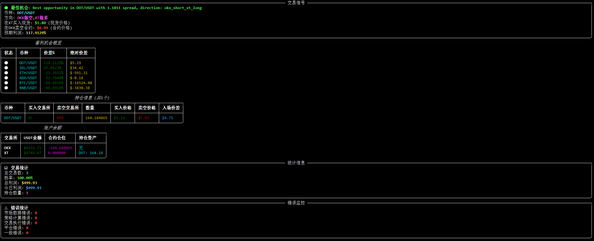

# Cross-Exchange Multi-Asset Arbitrage System (Multi-Asset ArbitrageBot)

This is an MVP (Minimum Viable Product) version of a multi-asset arbitrage bot that can monitor price differences of multiple trading pairs across OKX and XT exchanges and conduct simulated trading.

## Screenshot


## Arbitrage Principle
### Core Concept: What is "Cross-Exchange Contract Arbitrage"?
This is actually an arbitrage strategy. The basic idea is:

**Discover Price Spread**: When you find that the perpetual contract or futures contract price (e.g., Bitcoin BTC) on Exchange A is significantly higher than the spot price on Exchange B, an opportunity arises.

**Simultaneously Open Two Opposite Positions**:

- On the higher-priced Exchange A: Open a short (Sell Short) contract. Because you expect the price to fall and converge toward Exchange B's spot price.
- On the lower-priced Exchange B: Buy (Buy) an equal amount of spot Bitcoin with cash.

**Wait for Price Convergence**: When the price spread between the two markets narrows or even disappears (this usually happens inevitably, as arbitrageurs themselves push prices toward consistency), close both positions simultaneously.

**Earn Profit**: The profit comes from the initial price spread minus trading fees and funding costs.

### Example:

#### Assume Exchange A's BTC perpetual contract price is $61,000

Exchange B's BTC spot price is $60,000

Price spread is $1,000

#### Your Operations:

- Short 1 BTC contract on Exchange A (worth $61,000).
- Simultaneously buy 1 BTC spot on Exchange B (spend $60,000).

#### Scenario 1: Price converges to $60,500

- Exchange A (contract short): Price drops from $61,000 to $60,500, you profit $500.
- Exchange B (spot): Price rises from $60,000 to $60,500, you profit $500.

**Total profit**: $500 + $500 = $1000 (minus fees on both sides and Exchange A's short funding fees).

#### Scenario 2: Spot price rises, driving contract price up (but spread narrows)

- Exchange B spot rises to $61,500.
- Exchange A contract also rises to $61,800 (spread narrows from $1000 to $300).

- Exchange A (contract short): Price rises from $61,000 to $61,800, you lose $800.
- Exchange B (spot): Price rises from $60,000 to $61,500, you profit $1,500.

**Total profit**: $1,500 - $800 = $700 (minus fees).

**Regardless of whether prices rise or fall overall, as long as the spread narrows, you can profit.**

## Supported Trading Pairs

The system dynamically obtains trading pairs supported by OKX and XT exchanges and automatically selects trading pairs supported by both exchanges for arbitrage.

Default supported trading pairs, while dynamically obtaining coins supported by both exchanges:
- BTC/USDT
- ETH/USDT
- BNB/USDT
- ADA/USDT
- DOT/USDT

### Dynamic New Coin Detection
The system periodically checks the trading pairs supported by exchanges. When exchanges list new trading pairs, the system automatically identifies them and includes them in the arbitrage scope. For example, when SOL/USDT and other new trading pairs are listed, the system will automatically start monitoring and looking for arbitrage opportunities.

## Features

1. Real-time acquisition of multi-asset price data from OKX and XT exchanges
2. Calculate price differences and generate trading signals
3. Intelligently select optimal arbitrage opportunities (supporting bidirectional arbitrage strategy)
4. Simulated trading execution (spot long + contract short hedging strategy)
5. Real-time command-line dashboard display (using Rich library, no flickering)
6. Profit statistics and logging
7. Automatic position closing mechanism
8. Comprehensive error handling and monitoring mechanism

## Project Structure

Please refer to `PROJECT_STRUCTURE.md` for detailed project directory structure and file descriptions.

## Installation Dependencies

```bash
pip install -r requirements.txt
```

## Running Method

```bash
python main.py
```

## Usage Instructions

1. The system will automatically connect to simulated OKX and XT exchanges after startup
2. Real-time display of price data and spreads for all supported trading pairs (real-time dashboard without flickering)
3. The system automatically evaluates arbitrage opportunities for all trading pairs and selects the most profitable opportunity
4. When the spread exceeds the set threshold, the system will automatically execute simulated arbitrage trading
5. Trading results will be displayed on the dashboard and recorded in the log file
6. When the spread converges, the system will automatically close positions for profit
7. The dashboard includes an error monitoring panel that displays various error statistics in real-time
8. Press `Ctrl+C` to stop the program

## Configuration File

The configuration file is located at `config/config.yaml`, and the following parameters can be adjusted:
- Supported trading pair list
- Fee rates
- Minimum profit threshold
- Position size
- Initial capital, etc.

## Log Files

All trading activities and system information are recorded in the `logs/arbitrage_bot.log` file. The logs contain detailed error information and debug information for troubleshooting and system monitoring.

## Notes

1. The current version is for simulated trading only and does not use real funds
2. Exchange APIs are simulated implementations and do not connect to real exchanges
3. All trading records and profit statistics are stored in memory
4. This is an educational and testing project, please do not use it for actual investment decisions
